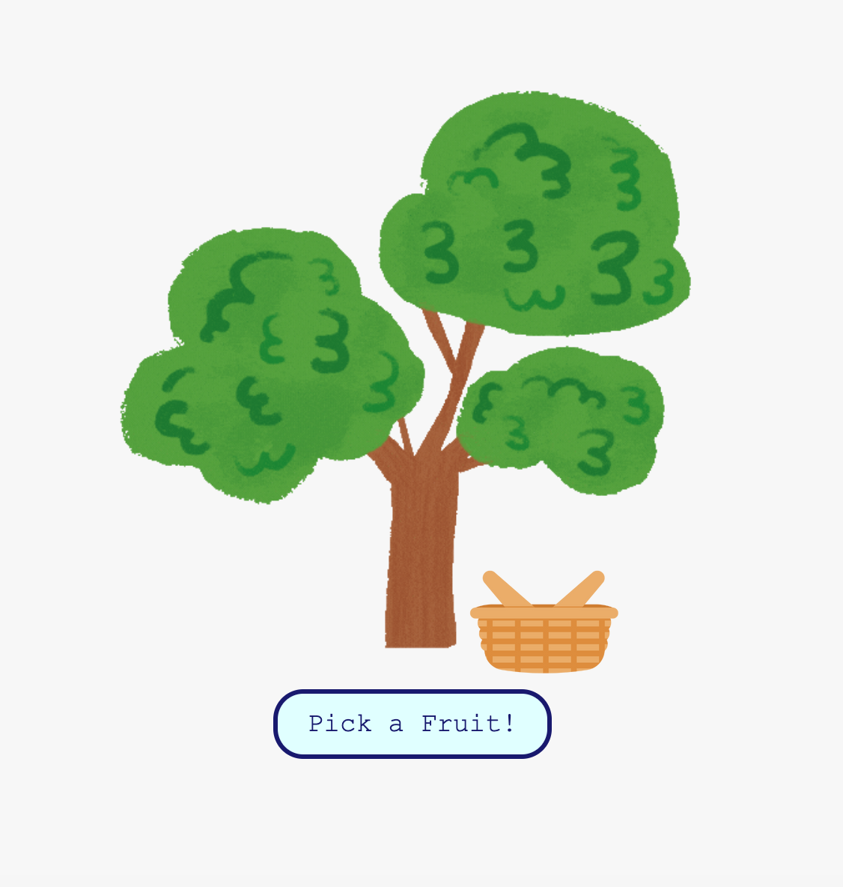

# 🍊 Is It Citrus? 🍋

A silly, fun web app that determines if a random fruit is a citrus! Click the button, watch the fruit drop, and get your answer.

## 🚀 Live Demo
[Click here to try it out!](https://jess-isaacs.github.io/is-it-citrus/)  

## 🎥 Preview
  

## 🛠️ Built With
- **HTML, CSS, JavaScript** (Vanilla JS, no frameworks)
- Hosted on **GitHub Pages**

## 🔧 How to Run Locally
1. Clone the repo:
   ```bash
   git clone https://github.com/jess-isaacs/is-it-citrus.git
